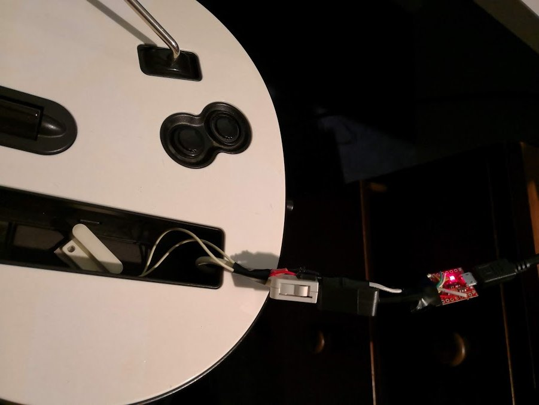

# Building the electronics for a Guitar

Note: If you want to use LEDs, look at that guide first, so that you don't accidentally use pins that are needed for the LEDs.

# Guide 1: Building a Wii adaptor
## You will need:
* An Arduino Leonardo, Pro Micro or Uno
* If you have a 5v Pro Micro, then you will need a level shifter.
* Some sort of tilt sensor (if you want tilt activation). This can be either a
  * Mercury switch (recommended), for avoiding accidental activations, two switches in series is recommended
  * [MPU 6050](https://invensense.tdk.com/products/motion-tracking/6-axis/mpu-6050/)
  * An analogue accelerometer, such as the [ADXL3xx](https://www.arduino.cc/en/Tutorial/ADXL3xx)
* A Wii extension breakout board or an extension cable, such as the [Nunchuky](https://www.adafruit.com/product/345)
* Some wire

## The finished product

## Steps
* Connect wires between SDA and SCL on the Wii breakout board. Looking up a pinout for your Arduino will let you know where these pins are.
* If using a MPU 6050, then connect its SDA and SCL pins as well. 
* If using a MPU 6050, connect its INT pin to a pin on your Arduino. 
* Connect all power pins to the Arduino. Note that it is important to use the 3.3v pin on your Arduinos. If you have a 5v Pro Micro, you will need to connect power through a level shifter.
* If using an analogue accelerometer, connect the axis that you would like to use to activate tilt, to an analogue pin. For example, if your guitar would be tilted around the x axis, then connect the x pin.
* If you are using a mecury switch (or two connected together), then connect one side to the GND pin on your Arduino, and then the other pin to a digital pin on your Arduino.
* Start the configuration tool, and plug in your Arduino. 
* Follow the [Tool Guide](./tool-guide.html) and configure your Arduino.
* Set the Controller Connectivity Type to Wii.
* Set the Tilt type to your tilt sensor. Under bindings, set your tilt axis to the pin that your tilt sensor is connected to.
* Hit write, and the controller should work. Note that you may need to unplug and plug your controller in in some cases, as Wii controllers don't handle programming correctly.

# Guide 2: Directly wired guitar
## You will need:
* An Arduino Pro Micro, Leonardo or Uno
* A guitar that you don't mind cannibalising
* Some sort of tilt sensor (if you want tilt activation). This can be either a
  * Mercury switch (recommended), for avoiding accidental activations, two switches in series is recommended
  * [MPU 6050](https://invensense.tdk.com/products/motion-tracking/6-axis/mpu-6050/)
  * An analogue accelerometer, such as the [ADXL3xx](https://www.arduino.cc/en/Tutorial/ADXL3xx)
  * If your guitar already has an accelerometer, it may be possible to use it, but it is recommended to use a mercury switch
* Some Wire

## Steps
* Hook up the whammy, and joysticks (if wiitar) to some analogue pins on your Arduino. Also hook up power to them.
* Hook the frets and other buttons to digital inputs. Hook the other side of the buttons to ground
* Start the configuration tool, and plug in your Arduino. 
* Follow the [Tool Guide](./tool-guide.html) and configure your Arduino.
* Set the Controller Connectivity Type to Direct.
* Set the Tilt type to your tilt sensor. Under bindings, set your tilt axis to the pin that your tilt sensor is connected to.
* Under bindings, set up the pins and buttons that you have hooked up to your Arduino
* Hit write, and the controller should work.
  
# Guide 3: LEDs
Note that for reactive LEDs to work, you need to launch your game through the configuration tool, as that is the only way for it to have access to the game.

## You will need:
* Either a working wii adaptor (Guide 1) or a Directly wired guitar (Guide 2)
* APA102 LEDs or some regular LEDs

## Steps (APA102)
* Hook the SCK and SCL to the SPI pins on your Arduino, this can be googled
* Hook the power to your APA102s, and daisy chain the leds to eachother (one for each fret)
* Set the LED type to APA102

## Steps (Regular LEDs (Only for a Directly wired guitar))
* Hook your frets up with a common positive pin instead of a common ground
* Put each led inline with the frets
* Hook the leds up to the digital pins you are using, with a 500 ohm resistor pulling each pin down to ground.
* Set the LED type to Inline