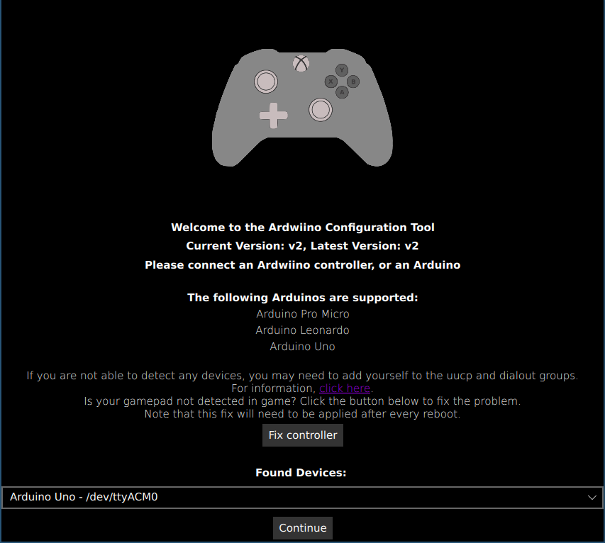
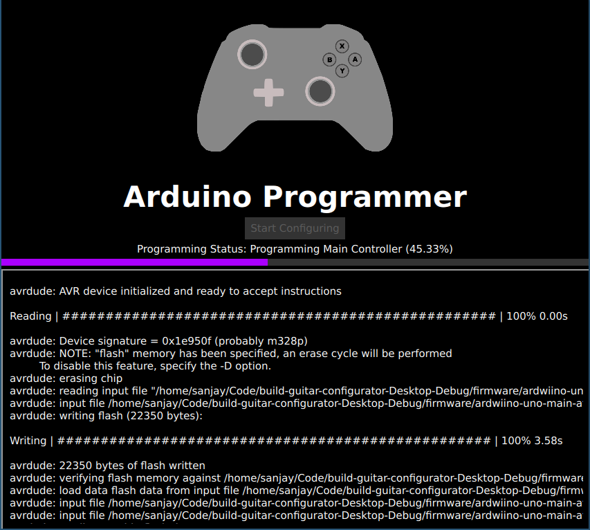
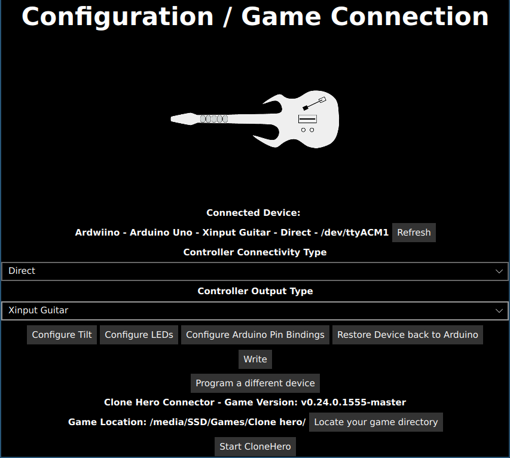
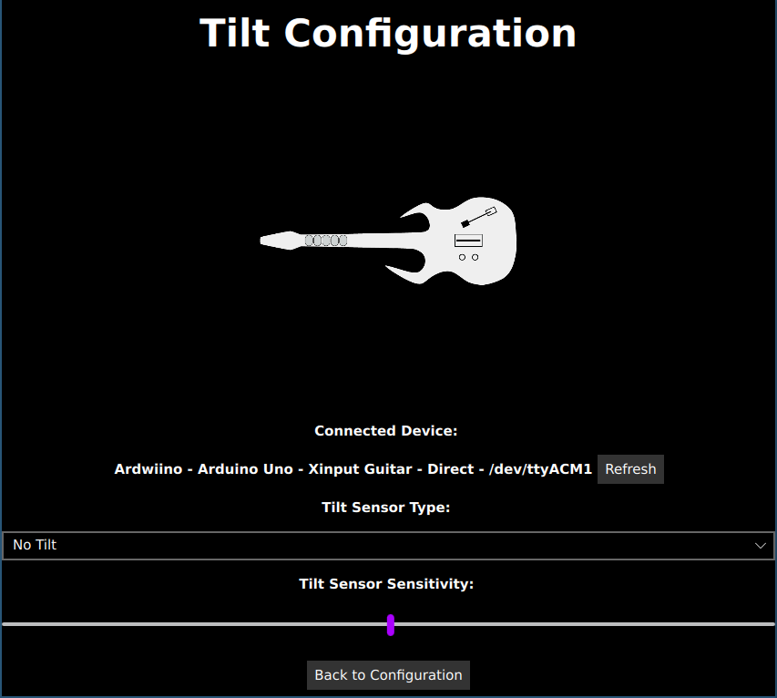
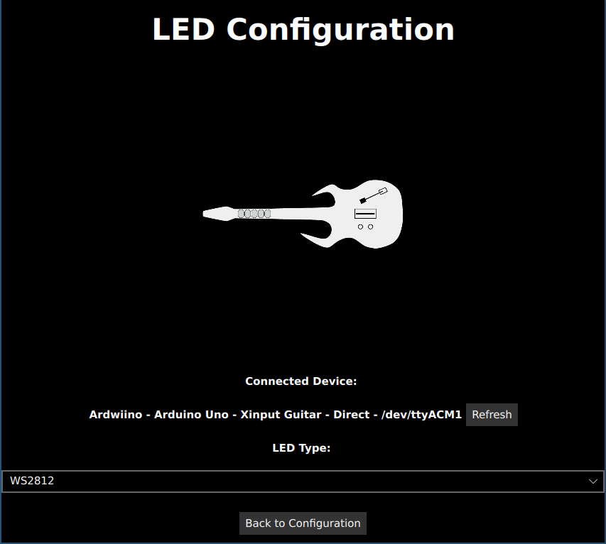
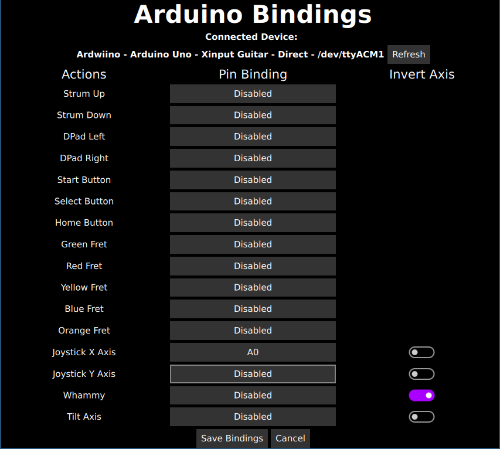
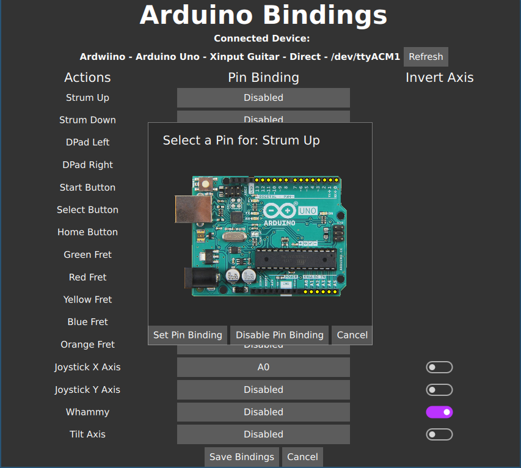

# Using the Ardwiino Configuration tool

Once you have downloaded the tool and installed it, run the tool, and you should be presented with the following screen

This welcome screen shows a list of all recognised connected devices. If you plug in your Arduino, it should show up. Select your Arduino, and then hit continue to start programming it.

Programming an Arduino is done by clicking Start Programing. Follow all instructions, Arduino UNOs require an extra step that is shown in the tool. Once programming is complete, hit Start Configuring.

This screen allows you to configure various aspects of your controller. The welcome screen will take you here if you choose an already programmed guitar. Note that this screen also allows you to connect your Clone Hero game, and when this is done, you will be able to start it from here. Doing this will allow the tool to connect to your game and read information for reactive LEDs.

First, we have the controller conectivity type. This can either be Wii for a Wii adaptor, or Direct if you plan to wire everything directly to the Arduino. 

The Controller Output Type allows for configuring what type of device your guitar will emulate. The XInput outputs are compatible with PC, and will work with any game expecting XInput. This will also work with games that expect a guitar like GH3. PS3 and Switch controllers work with their respective consoles, and so they are useful if you wish to play console games with your controller.

Clicking Configure Tilt will allow you to configure tilting the device to activate star power. Here you can choose what type of tilt sensor you have (or disable the feature) and you can set the sensitivity of the tilt sensor. This allows you to move around where the tilt activates.

Clicking Configure LEDs will bring you to this screen, where you can configure any LEDs that are plugged in. WS2812 and APA102 will configure pins that can directly communicate with those types of LEDs. These modes are explained in more detail in the [build guide](./build-guide.html).

Clicking Configure Arduino Bindings will take you to a screen that allows you to map pins on your Arduino to different actions. This only shows when the connectivity type is set to Direct. Clicking on an action will bring up the following screen, which allows you to visually click on the pin that maps to that action.

This screen is customised for the type of Arduino you are using. For actions that map to a joystick axis, you have the option to invert the axis. This is useful if you wire an analogue sensor in reverse, as it will invert the value.

For arduino UNOs, the option to restore the device back to an Arduino is given, and this will take the user back to the programming screen, where they can program their Arduino back to the original firmware. Other arduinos do not need this, as they can be programmed normally using the IDE even when running the Ardwiino firmware.

The write button will write your changes to your Arduino. This will cause it to restart.

If your Arduino is running an old firmware, there will be an update button next to the refresh button. This button will allow you to update the firmware, and will take you back to the programming screen to do this.

Program a different device will just take you back to the welcome screen to pick a different device.

